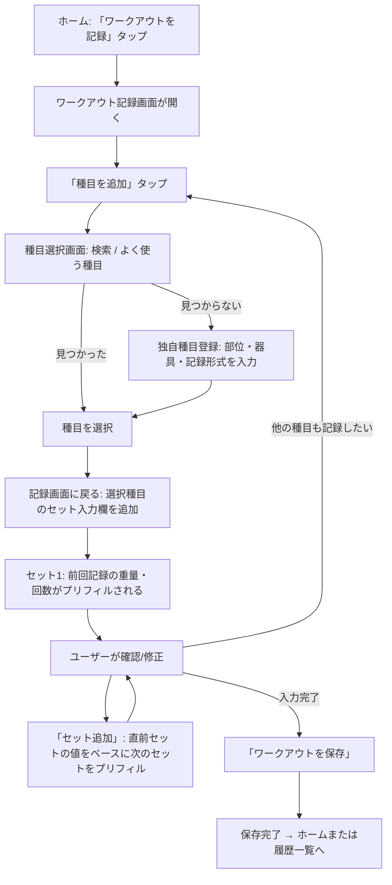
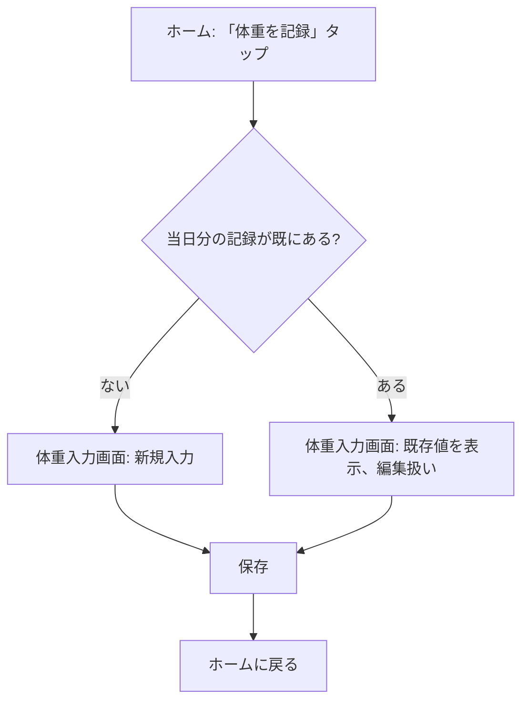

# 画面一覧と主要フロー(R1)

## ナビゲーション構造

モバイルでは下部タブ(ホーム / 履歴 / グラフ / 設定)、PC/タブレットでは同じ構成を上部ナビとして表示する(レスポンシブ1本、コンポーネントの出し分けのみ)。

## 画面一覧

| #   | 画面名                 | 概要                                                             | 遷移元          |
| --- | ---------------------- | ------------------------------------------------------------------ | ---------------- |
| 1   | ログイン               | Googleログインボタンのみ                                          | 未認証時の初期表示 |
| 2   | ホーム                 | 「ワークアウトを記録」「体重を記録」の大きいボタン。直近記録の軽いサマリ | ログイン後トップ、タブ |
| 3   | 種目選択               | マスタ+独自種目を検索・選択。新規種目登録への導線                   | ワークアウト記録画面 |
| 4   | 独自種目登録           | 種目名・部位・器具タイプ・記録形式を入力(全て必須)。類似種目のサジェスト表示 | 種目選択画面     |
| 5   | ワークアウト記録       | 種目ごとにセット(重量・回数)を入力。前回記録をプリフィル             | ホーム           |
| 6   | ワークアウト履歴一覧   | 過去のワークアウトをリスト表示                                     | タブ             |
| 7   | ワークアウト詳細・編集 | 記録内容の閲覧・修正・削除                                          | 履歴一覧         |
| 8   | 体重記録               | 当日の体重を入力(入力済みなら編集扱い)                              | ホーム           |
| 9   | ダッシュボード         | 体重グラフ(日次+7日移動平均)、種目別重量推移                        | タブ             |
| 10  | 種目別重量推移(詳細)   | 特定種目のグラフを拡大表示                                          | ダッシュボード   |
| 11  | アカウント設定         | ログアウト、データ削除                                              | タブ             |

## 主要フロー

### ワークアウト記録(モバイル・片手入力を最優先)



ポイント:

- 種目追加 → セット入力のループを繰り返すだけで1ワークアウトが完結する
- 前回値のプリフィルは「同じ種目の直近の記録」を都度参照する([03-domain-rules.md](./03-domain-rules.md) 参照)
- 数値入力は `inputmode="decimal"` でテンキー表示、タップ領域は大きめに確保する([要件検討メモ](../../筋トレ実績記録Webアプリ%20要件検討メモ.md) 4.2節)

### 体重記録



### 振り返り(ダッシュボード閲覧)

```mermaid
flowchart TD
    A[タブ: ダッシュボード] --> B[体重グラフ: 日次 + 7日移動平均]
    A --> C[種目別重量推移一覧]
    C --> D[種目をタップ]
    D --> E[種目別重量推移(詳細)]
```

## 未確定・要検討

- ワークアウト詳細・編集画面(#7)は、記録画面(#5)を編集モードで開く形で兼用する想定。専用UIが必要かは実装時に判断する
- 「よく使う種目」の判定ロジック(直近使用順 or 登録順)は実装時に決める
